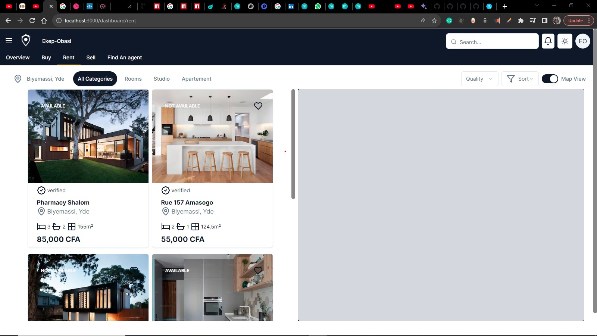

# Homely 🏠
[](https://github.com/Ekep-Obasi/homely)

## 💥 Introduction

**Homely** is a full-stack house rental application built with ✨ **Next.js** ⚡️ and 💯 **TypeScript** on the frontend, and 🐙 **Node.js** 🚆 and 🚦 **Express** on the backend. It uses 🔥 **Firebase** for authentication, and stores secret keys in a 🔐 `.env` file. The frontend uses ✨ **Shadcn UI** for most of its UI components. The app features:

* 🎉 **Interactive dashboard** :tada:
[](https://github.com/Ekep-Obasi/homely)
* 🗺️ **Amazing map** :globe_with_meridians:
[](https://github.com/Ekep-Obasi/homely)
* 💬 **Minimal chat section** :speech_balloon:
[](https://github.com/Ekep-Obasi/homely)
* 🗄️ **MongoDB for data storage**
[](https://github.com/Ekep-Obasi/homely)

## Getting Started

### Prerequisites

* 🔌 **Node.js v16.x or higher**
[](https://nodejs.org/en/)
* 🧶 **Yarn v1.22.x or higher**
[](https://classic.yarnpkg.com/en/)

## 🛠️ Local development

That's pretty easy. To ensure that you are able to install everything properly, we would recommend you to have <b>Git</b>, <b>NPM</b> and <b>Node.js</b> installed.

We will first start with setting up the Local Project Environment:

```sh
git clone https://github.com/Ekep-Obasi/Homely.git
cd Homely
npm run dev:install
```
Now we will add the environment variables in the client/ and server/

 - Create a .env file in both client and server folder according to .example.env given in both the folders respectively.

Once you run the Commands and get environment variables and everything fine, we are all set to run the app ✔️

On the root level run the following command:

```sh
npm run dev
```

To lint the code files, run the following command on root level:

```sh
npm run lint
```

The app will be available at 🔗 **http://localhost:3000**.

## Features

* 🎉 **Interactive dashboard**
* 🗺️ **Amazing map**
* 💬 **Minimal chat section**
* 🗄️ **MongoDB for data storage**

## Tech Stack

* ✨ **Frontend:** Next.js, TypeScript, Shadcn UI
* 🐙 **Backend:** Node.js, Express, MongoDB

## Contribution

Contributions are welcome! Please open a pull request if you have any improvements or bug fixes.

## License

Homely is licensed under the 📝 **MIT License**.
